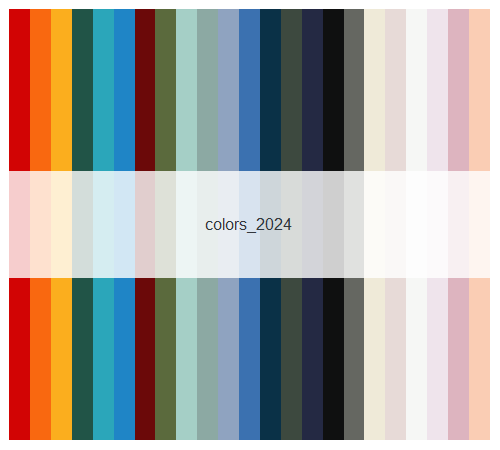
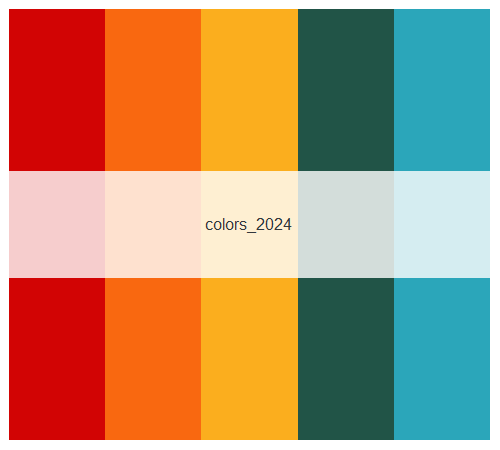
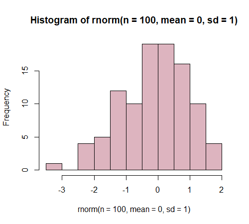

# lecreuset
Contains code for R package with R color palettes inspired by Le Crueset cookware.
Code adopted from the lovely `inauguration` R package by Cianna Bedford-Petersen, available [here](https://github.com/ciannabp/inauguration). 

# R package installation
Install the  `lecreuset` R package using the following code:
``` r
#install.packages("devtools")
devtools::install_github("kimberlywebb/lecreuset", ref="main")
library(lecreuset)
```

# Using the lecreuset package
Use the `names` function to view the available color palettes and the colors within the palette.
```r
names(lc_palettes)
# [1] "colors_2024" 
```

```r
names(lc_palettes$colors_2024)
#  [1] "Cerise"       "Flame"        "Nectar"      
#  [4] "Artichaut"    "Caribbean"    "Marseille"   
#  [7] "Rhone"        "Olive"        "Sage"        
# [10] "Sea Salt"     "Chambray"     "Azure"       
# [13] "Agave"        "Thyme"        "Matte Navy"  
# [16] "Licorice"     "Oyster"       "Meringue"    
# [19] "Brioche"      "White"        "Shallot"     
# [22] "Chiffon Pink" "Peche" 
```

Call the palette using the `render_lc_palette` function
```r
render_lc_palette("colors_2024")
```


View a subset of the color scheme
```r
render_lc_palette("colors_2024", 5)
```


Use colors from `carnegie_palettes` in your graphs
```r
set.seed(2024)
hist(rnorm(n = 100, mean = 0, sd = 1), col = lc_palettes[["colors_2024"]]["Chiffon Pink"])
```

